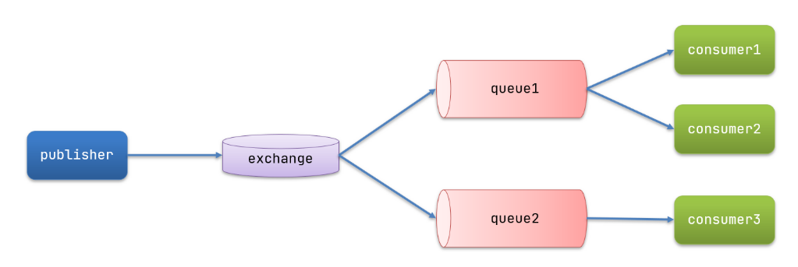

## 1.微服务异步保存日志信息



### 1.1 新建 logListen微服务
1. 导依赖
    ```java
      <!--AMQP依赖，包含RabbitMQ-->
        <dependency>
            <groupId>org.springframework.boot</groupId>
            <artifactId>spring-boot-starter-amqp</artifactId>

2. 编写启动类
```java
@SpringBootApplication
public class listenApp {
    public static void main(String[] args) {
        SpringApplication.run(listenApp.class,args);
    }
}
```
3.编写配置文件
```yaml
server:
  port: 8087
spring:
  application:
    name: order
  rabbitmq:
    host: 192.168.138.100 # 主机名
    port: 5672 # 端口
    virtual-host: / # 虚拟主机
    username: itcast # 用户名
    password: 123321 # 密码
```
4.写监听器
```java
@Component
public class ListenLog {
    //consumer
    //rabbitMq 的direct 方式监听器
    @RabbitListener(bindings = @QueueBinding(
            value = @Queue(name = "direct.queue1"),
            exchange = @Exchange(name = "logexchange", type = ExchangeTypes.DIRECT),
            key = {"log"}
    ))
    public void listenDirectQueue1(String log) {
        FileWriter fw = null;
        BufferedWriter bw = null;
        try {
            fw = new FileWriter("d:\\log.log", true);
            bw = new BufferedWriter(fw);
            bw.write(log);
            bw.newLine();
        } catch (IOException e) {
            e.printStackTrace();

        } finally {

            try {
                bw.close();
                fw.close();
            } catch (IOException e) {
                e.printStackTrace();
            }
        }
    }

}

```

5.消息生产者 发送消息 orderservice
    注入rabbitTemplate
```java
    @Autowired
    private RabbitTemplate rabbitTemplate;
```

    发送消息
```java
     rabbitTemplate.convertAndSend("logexchange","log",log);
```


